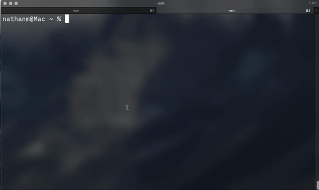

# Terminal Teleporter

A simple command line tool to add convenient markers to jump around directories

## Demo


## Installation

The following function must be added to your bash configuration (.bashrc / .zshrc)

~/.local/bin/tp.py can be changed to wherever you wish to keep the script.
```
function tp() {
	if [ "$1" = "--add" ] || [ "$1" = "-a" ]; then
		python3 ~/.local/bin/tp.py "$@"
	else
		dir=$(python3 ~/.local/bin/tp.py "$1")
		if [ -d "$dir" ]; then
			cd "$dir"
		else
			echo "Error: $dir"
		fi
	fi
}
```

## Usage

To add a new marker run the `tp` command with the `-a` or `--add` flag and then the name of the marker to create

To jump to a marker simply use `tp marker_name`


## Important Notes

Currently does **not** work on windows

There is currently no way to delete or edit markers other than directly editing `~/term-tp/testfail.txt`
*(yes, i need to rename the file)*
